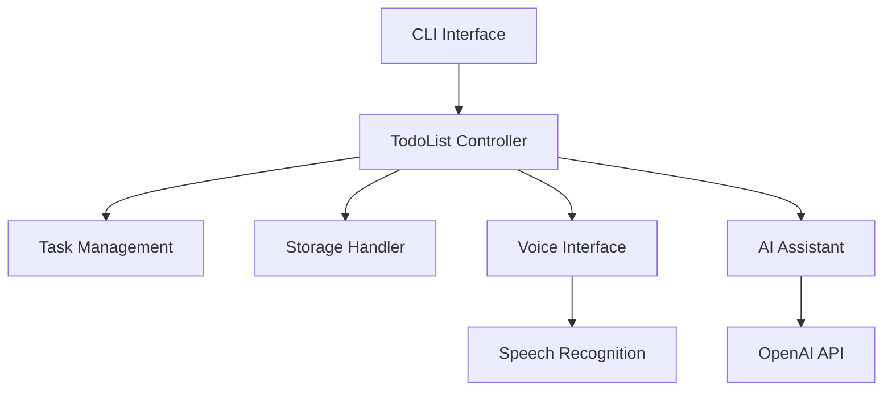

# Ultimate To-Do List Manager

**Professional Task Management System with AI Integration**

 

## Overview
A sophisticated task management system that combines traditional to-do list functionality with AI-powered features. This application helps professionals manage tasks efficiently through a CLI interface with voice control capabilities, natural language processing, and productivity insights.

## Key Features

### 🧠 AI-Powered Productivity
- **Auto-Categorisation**: AI assigns categories to new tasks using GPT-3.5
- **Predictive Time Estimates**: Forecasts task completion time based on historical data
- **Habit Analysis**: Identifies productivity patterns using statistical analysis

### 🗣️ Voice Interface
- Voice command recognition for hands-free task management
- Supported commands: 
  - Add tasks ("Add buy milk tomorrow")
  - Complete tasks ("Complete task 3")
  - Check status ("What are my tasks?")

### 📊 Advanced Task Management
- Priority levels (High/Medium/Low) with color-coding
- Custom categories and tags
- Due dates with overdue highlighting
- Detailed productivity statistics and visualisations
- CSV export functionality

### 🔍 Smart Search & NLP
- Natural Language Processing for task creation ("Call client at 3pm tomorrow high priority")
- Advanced search filters:
  - Category/tag filtering
  - Priority-based search
  - Due date ranges

## Technical Implementation

### Architecture

## Core Components

1. Task Management Engine (app.py)
    - CRUD operations for tasks
    - Statistical analysis and reporting
    - Predictive time estimation algorithm
2. AI Integration (ai_assistant.py)
    - GPT-3.5 powered suggestions
    - Automatic task categorisation
3. Voice Control (voice_interface.py)
    - Speech-to-text command processing
    - Background listening thread
4. Natural Language Processing (nlp_processor.py)
    - Date/time extraction
    - Priority detection
    - Command parsing
5. Persistent Storage (storage.py)
    - JSON-based task storage
    - Datetime serialisation/deserialisation
